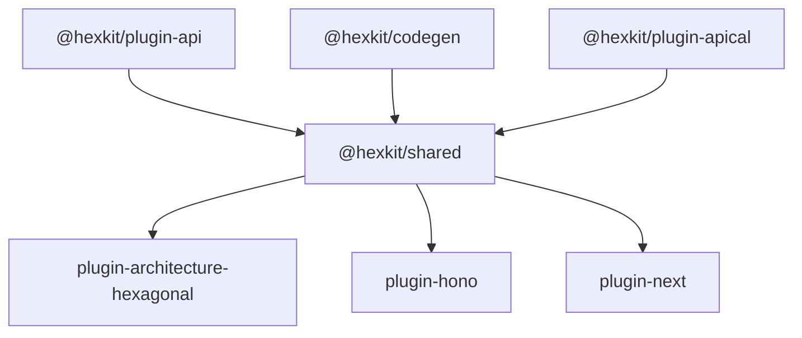

# Hexkit

Hexkit is a contract-driven generator for production-ready TypeScript REST API
applications. Generated projects follow Ports & Adapters and use OpenAPI 3.1,
Apical TS, Zod, Hono, Drizzle ORM, PostgreSQL, AWS Lambda, and SST.

The architectural design is documented in [RFC.md](./RFC.md). PoC product
requirements and acceptance criteria are in [PRD.md](./PRD.md).

## Project status

**Stage:** PoC complete (2026-08-22). Remaining work is post-PoC (full Petstore
OpenAPI, SST/AWS, OAuth).

| Area                                                                      | Status                                                                                    |
| ------------------------------------------------------------------------- | ----------------------------------------------------------------------------------------- |
| `@hexkit/core`, `@hexkit/codegen`, `@hexkit/plugin-api`, `@hexkit/shared` | Implemented — pipeline, file writer, plugin contracts, shared calculations + test harness |
| `@hexkit/plugin-apical`                                                   | Implemented — Craft → Zod contracts + manifest                                            |
| `@hexkit/plugin-architecture-hexagonal`                                   | Implemented — domain, ports, use-case skeletons                                           |
| `@hexkit/plugin-hono`                                                     | Implemented — default HTTP adapter                                                        |
| `@hexkit/plugin-next`                                                     | Implemented — opt-in Next.js Route Handlers + RSC (`--http next`)                         |
| `@hexkit/plugin-drizzle`                                                  | Implemented — Postgres schema, repos, nested JSONB columns                                |
| `@hexkit/cli`                                                             | Implemented — `hexkit generate` with Hono/Next selection                                  |
| Docker Compose packaging                                                  | Implemented — emitted by CLI for Hono and Next                                            |
| `@hexkit/plugin-sst`                                                      | Scaffold only (`export {}`) — deferred post-PoC                                           |
| AWS Lambda / SST deploy                                                   | Not in PoC scope                                                                          |
| GitHub Actions CI                                                         | `.github/workflows/ci.yml` — Quality + Dogfood API + Dogfood NextJS (parallel)            |

**Automated tests:** ~100+ Vitest cases across Hexkit plugins and the CLI
(`vp run --filter './packages/*' --filter './apps/cli' build` then the matching
`test` run). Generator packages (`packages/*` + `apps/cli`) also enforce a
**90% Vitest coverage gate** via `vp run coverage` (wired into `vp run ready`).
`apps/petstore-next` has no app test suite by design (`@hexkit/plugin-next` and
CLI tests cover the generator).

**Dogfood loops** (Docker required unless noted):

| Command                        | What it proves                                                          |
| ------------------------------ | ----------------------------------------------------------------------- |
| `vp run dogfood`               | Hono Rich Pet + Order + User from `openapi.poc.yaml` → Compose → Pactum |
| `vp run dogfood-petstore-next` | Next PetShop fixture; `HEXKIT_SKIP_COMPOSE=1` for generate-only         |
| `vp run dogfood-auth`          | Auth fixture with in-memory stub authenticator                          |

**After PoC:** expand toward the full Petstore OpenAPI (Hono and Next.js
progress is tracked in [`docs/petstore-openapi-progress.md`](./docs/petstore-openapi-progress.md);
update that file whenever adapter support changes). PR validation runs three
parallel GitHub Actions jobs: Quality (Hexkit), Dogfood API (generated Hono Pet
Shop + Pactum), and Dogfood NextJS (generated Next Pet Shop lint/build).

## Workspace

- [`apps/cli`](./apps/cli/README.md) — Hexkit command-line application
- [`apps/petstore-sample`](./apps/petstore-sample/README.md) — canonical generation and deployment sample
- [`apps/petstore-next`](./apps/petstore-next/README.md) — vanilla Next.js PetShop dogfood fixture (opt-in `--http next`)
- [`packages/core`](./packages/core/README.md) — generation orchestration
- [`packages/codegen`](./packages/codegen/README.md) — shared source generation utilities
- [`packages/shared`](./packages/shared/README.md) — shared generator calculations and plugin-test harness
- [`packages/plugin-api`](./packages/plugin-api/README.md) — plugin contracts and lifecycle
- [`packages/plugin-apical`](./packages/plugin-apical/README.md) — Apical TS contract generation
- [`packages/plugin-architecture-hexagonal`](./packages/plugin-architecture-hexagonal/README.md) — hexagonal architecture generation
- [`packages/plugin-hono`](./packages/plugin-hono/README.md) — Hono HTTP adapter generation (default)
- [`packages/plugin-next`](./packages/plugin-next/README.md) — Next.js App Router adapter generation (opt-in)
- [`packages/plugin-drizzle`](./packages/plugin-drizzle/README.md) — Drizzle persistence adapter generation
- [`packages/plugin-sst`](./packages/plugin-sst/README.md) — SST infrastructure generation
- [`docs`](./docs/README.md) — project documentation

Generator packages that share HTTP and contract calculations import `@hexkit/shared`. That package is a library, not a `hexkit generate` pipeline step:



## Development

Install dependencies:

```bash
vp install
```

Run all checks, tests, builds, and the generator coverage gate:

```bash
vp run ready
```

CI (`.github/workflows/ci.yml`) runs three parallel jobs on pushes to `main`
and on pull requests:

| Job                | What it validates                                                                                                            |
| ------------------ | ---------------------------------------------------------------------------------------------------------------------------- |
| **Quality**        | Hexkit only: pack, Oxlint/`tsc`, unit tests, 90% coverage; Vitest GitHub Actions reporter (package-named) + coverage-% table |
| **Dogfood API**    | `hexkit generate` Hono Pet Shop → Oxlint + `tsc` → Compose build → Pactum                                                    |
| **Dogfood NextJS** | `hexkit generate --http next` Pet Shop → ESLint 9 + `next build` (no app tests)                                              |

Run Hexkit quality locally (same scope as the Quality job):

```bash
vp run ready
```

Or an individual Hexkit stage:

```bash
vp run --filter './packages/*' --filter './apps/cli' --fail-if-no-match build
vp check
vp run --filter './packages/*' --filter './apps/cli' --fail-if-no-match test
vp run coverage
```

`vp run coverage` runs Vitest with `@vitest/coverage-v8` for `packages/*` and
`apps/cli` only (shared thresholds in `coverage.config.ts`: 90% statements,
branches, functions, and lines). Dogfood apps are excluded.

Start the CLI package in watch mode:

```bash
vp run dev
```

## Petstore dogfood

Run the uncached root dogfood task from the workspace root:

```bash
vp run dogfood
```

The task generates a Hono Rich Pet + Order + User app from `openapi.poc.yaml` (nested
Pet fields as JSONB; Order `petId` FK; User lookup by `username`; `GET /pet/{petId}` requires header
`api_key`), then lints and typechecks **that generated tree**, Compose-builds
it, and runs Pactum. It passes through `PETSTORE_API_URL`, `AUTH_API_KEYS`,
`HEXKIT_KEEP_STACK`, and `HEXKIT_DOGFOOD_OUTPUT`. Docker is required for the
live Compose and API phases.
`apps/petstore-sample/scripts/prove-api-url.sh` verifies task-level environment
propagation without starting Compose.

## Auth API dogfood

Run the auth fixture Compose + Pactum acceptance loop (in-memory stub auth):

```bash
vp run dogfood-auth
```

Uses `apps/fixtures/auth-api/openapi.yaml`. Passes through `AUTH_API_URL`,
`HEXKIT_KEEP_STACK`, and `HEXKIT_DOGFOOD_OUTPUT`. This loop is local-only (not a
CI job).

## Next.js PetShop dogfood

Hono remains the default HTTP adapter. Opt in to Next.js with `--http next` and
`--next-surface both|routes|rsc` (default `both`). OpenAPI maps to Route
Handlers; Server Actions are fixture UI only, not the OpenAPI surface.

Generate, merge, and start the vanilla create-next-app-shaped fixture:

```bash
vp run dogfood-petstore-next
```

Or manually:

```bash
hexkit generate apps/petstore-sample/openapi.poc.yaml /tmp/petstore-next \
  --http next --next-surface routes
```

See [`apps/petstore-next/README.md`](./apps/petstore-next/README.md) for the
generate-to-TMP merge algorithm. The PetShop app has no automated test suite;
`@hexkit/plugin-next` stays domain-agnostic (PRD §5.0).
