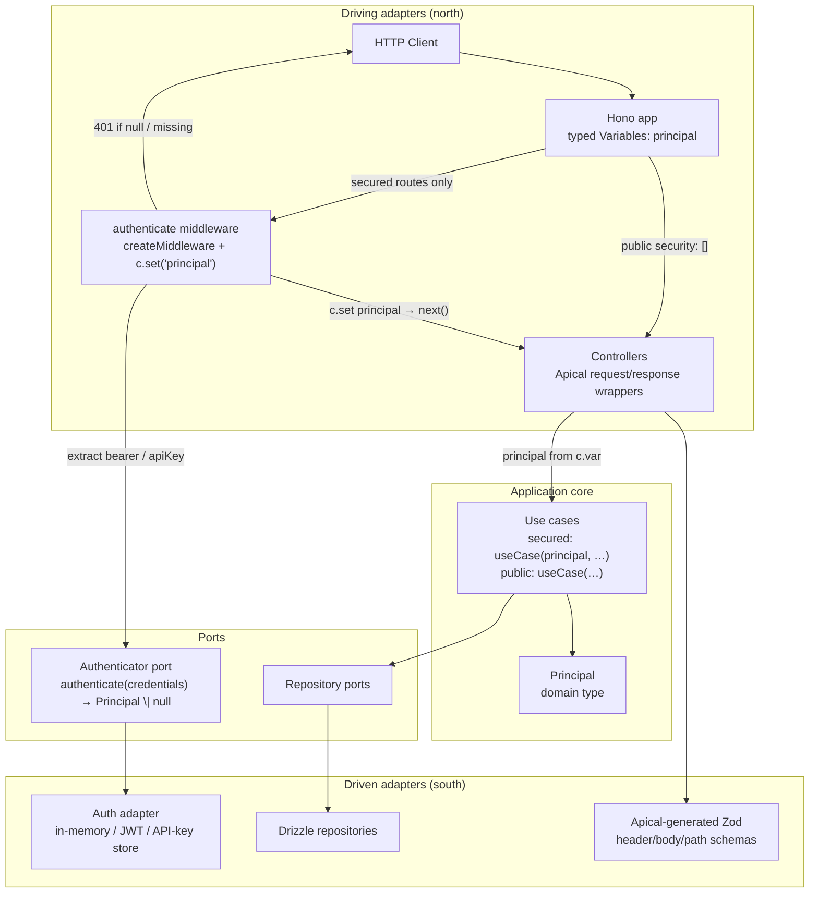
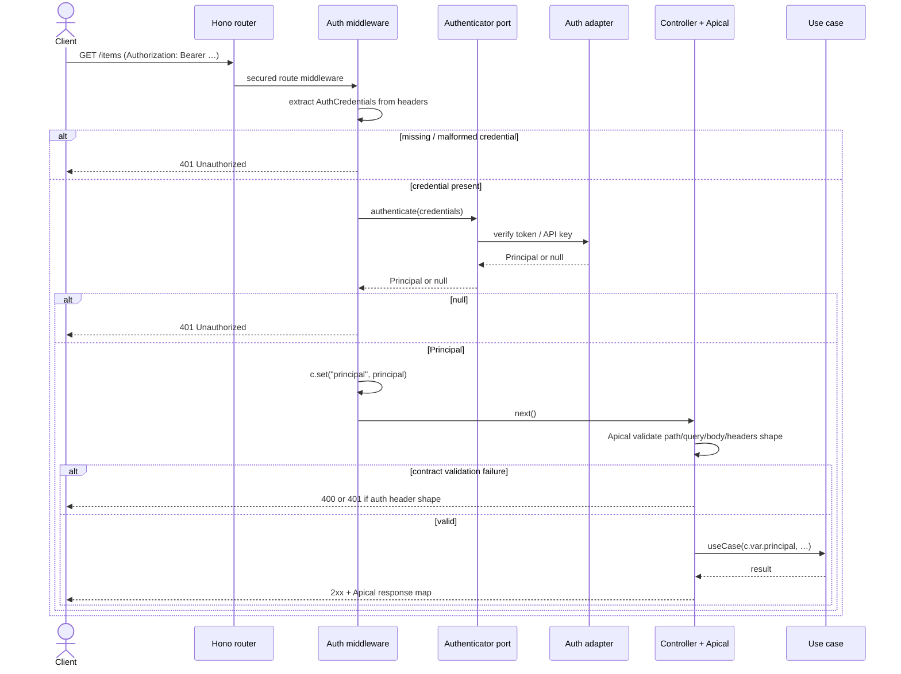

# Design: OpenAPI Authentication Support in Hexkit

**Status:** Partially implemented (August 2026) — auth fixture + generator wiring on `main`; Petstore PoC `getPetById` header `api_key` is specified in [2026-08-21-petstore-header-apikey-design.md](./2026-08-21-petstore-header-apikey-design.md)  
**Date:** 2026-08-05  
**Companion:** [RFC.md](../../../RFC.md), [PRD.md](../../../PRD.md)  
**Implementation plan:** [2026-08-05-openapi-auth.md](../plans/2026-08-05-openapi-auth.md)

## 1. Problem

Hexkit generates hexagonal TypeScript apps from OpenAPI via Apical TS. Auth is explicitly out of the **PoC contract** (`PRD.md` §2 / §11), but generator plugins now support secured fixtures (see `apps/fixtures/auth-api`). Petstore’s full OpenAPI already declares `oauth2`, `apiKey`, and `mutualTLS`, but:

1. `openapi.poc.yaml` has **no** `security` / `securitySchemes` (intentional for PoC).
2. ~~`ContractArtifact` dropped security metadata~~ — **addressed** for secured fixtures; `plugin-apical` carries security IR used by downstream plugins.
3. ~~Generated Hono controllers mapped auth header failures to HTTP 400~~ — **addressed** for secured operations (401 for auth failures).
4. ~~No principal / authenticator concept~~ — **addressed** — hexagonal `Principal` / `Authenticator` ports and a stub in-memory adapter are generated for secured contracts (`apps/fixtures/auth-api` dogfood).

Original gaps (pre-implementation) motivated a contract-first path to support API authentication that:

- Stays aligned with how **Apical TS** models security.
- Preserves **Ports & Adapters** boundaries (HTTP ≠ domain).
- Remains **domain-agnostic** (no Petstore hardcoding in plugins).
- Avoids inventing a second schema system (OpenAPI → Apical → Hexkit IR only).

## 2. How Apical TS handles authentication (findings)

Apical (`@apical-ts/craft` **0.26.0**) does **not** verify credentials. It turns OpenAPI security into **typed header presence** for clients and servers.

### 2.1 Recognized schemes

From Apical’s `analyzeSecurityScheme`:

| OpenAPI scheme                         | Apical behavior                            |
| -------------------------------------- | ------------------------------------------ |
| `apiKey` + `in: header` + `name`       | Header named by `name` (normalized casing) |
| `http` + `scheme: bearer`              | Header `Authorization`                     |
| `apiKey` in `query` / `cookie`         | **Ignored** (not header-based)             |
| `http` + `basic` (and other HTTP auth) | **Ignored**                                |
| `oauth2` / `openIdConnect`             | **Ignored** as header emitters             |
| `mutualTLS`                            | **Ignored**                                |

OAuth2 / OIDC in OpenAPI are documentation of _how clients obtain tokens_. Apical only models the wire credential when it is a bearer/API-key **header**.

### 2.2 Global vs operation `security`

| Spec shape                        | Apical meaning                                                                 |
| --------------------------------- | ------------------------------------------------------------------------------ |
| Root `security: [{ scheme: [] }]` | Global auth headers; client optional; **server schema requires** the header(s) |
| Operation omits `security`        | Inherit global                                                                 |
| `security: []`                    | Override that **disables** auth for that operation                             |
| `security: [{ scheme: [] }]`      | Override; those headers are **required** on the operation                      |
| Multiple objects in `security` OR | Spec OR; Apical **merges headers into one Zod object** (effectively AND)       |

**Important limitation:** OpenAPI `security: [ {A:[]}, {B:[]} ]` means A **or** B. Apical currently emits a single object requiring **both** headers. Hexkit must document this and, for v1, either:

- Prefer single-scheme requirements in dogfood fixtures, or
- Treat Apical’s AND behavior as upstream truth and not invent OR semantics until Apical fixes it.

### 2.3 What Apical generates

For secured operations (with `--server`):

- `*ServerHeadersSchema` — Zod object with lowercase header keys (e.g. `authorization`, `x-api-key`).
- Server wrappers validate `req.headers` and return `{ kind: "headers-error", ... }` when missing/invalid.
- Route metadata embeds those schemas in `params.shape.headers`.
- Client code injects global headers from `config.headers`, override headers from `params.headers`.

**Apical’s auth story ends at “header shape validated.”** Credential verification, session lookup, JWT signature checks, OAuth redirects, and scope enforcement are out of Apical’s scope — and therefore Hexkit’s responsibility if we want real authentication.

### 2.4 Empirical sample (Apical 0.26.0)

Given global `bearerAuth`, `security: []` on `/public/health`, override `apiKey` on `POST /pets`, and OR `bearerAuth|apiKey` on `GET /pets/{id}`:

| Operation   | Server headers schema                                     |
| ----------- | --------------------------------------------------------- |
| `getHealth` | _(none — no header validation)_                           |
| `listPets`  | `{ authorization: z.string() }` (global, required server) |
| `createPet` | `{ "x-api-key": z.string() }` (override)                  |
| `getPet`    | `{ authorization, "x-api-key" }` both required (AND bug)  |

## 3. Hexkit gap analysis

| Layer                           | Today                                             | Needed for auth                                              |
| ------------------------------- | ------------------------------------------------- | ------------------------------------------------------------ |
| OpenAPI input                   | PoC fixture has no security                       | Dogfood fixture with apiKey and/or bearer                    |
| `plugin-apical` IR              | Schemas + operations only                         | Security schemes + resolved per-operation requirements       |
| `plugin-architecture-hexagonal` | Domain, repos, use cases                          | Optional `Principal`, `AuthPort`, use-case context           |
| `plugin-hono`                   | Routes + controllers; all invalid → 400           | Distinguish auth header failure → 401; wire authenticator    |
| Runtime / adapters              | DB + HTTP only                                    | Auth adapter stub (verify API key / bearer) — protected zone |
| Apical contracts                | Already emit header schemas when security present | Consume as boundary validation (do not re-model headers)     |

## 4. Approaches considered

### Approach A — Presence-only (Apical headers → 401)

**Idea:** Extend IR enough to know which operations are secured. Map Apical `headers-error` on secured ops to HTTP 401. No principal, no verification port.

| Pros                                 | Cons                                                  |
| ------------------------------------ | ----------------------------------------------------- |
| Smallest change; reuses Apical fully | Not real authentication — any non-empty header passes |
| Good first milestone                 | Business logic cannot authorize by identity/scopes    |
| Matches Apical’s own ceiling         | Easy to over-claim “auth support”                     |

### Approach B — Hexagonal Auth Port + Principal (recommended)

**Idea:** Treat “credential on the wire” (Apical) and “identity in the domain” (Hexkit) as separate concerns.

1. **Contract IR** carries schemes + effective requirements per operation (derived from OpenAPI the same way Apical does, for generator decisions).
2. **HTTP adapter** uses Apical wrappers for header _presence_; maps auth-related header failures to **401**.
3. **Auth port** in `core/ports` verifies credentials → `Principal | null`.
4. **Auth adapter** (generated stub, protected or regenerable-with-hook) implements verification (API key lookup / JWT verify) — details stay out of domain.
5. **Use cases** that require auth receive `Principal` (or a request context), never raw headers or Hono `Context`.

| Pros                                                         | Cons                                           |
| ------------------------------------------------------------ | ---------------------------------------------- |
| Correct hexagonal boundaries                                 | More IR + generation surface than A            |
| Verification swappable (in-memory, DB, IdP JWKS)             | OAuth _flows_ still deferred                   |
| Aligns with RFC “clear extension points”                     | Must carefully avoid double-validating headers |
| Dogfoodable with apiKey + bearer without Petstore hardcoding | Scope/roles authorization is a follow-up       |

### Approach C — Dedicated `@hexkit/plugin-auth`

**Idea:** New pipeline plugin owns auth adapters, env config, and scheme-specific generators. Hexagonal/Hono plugins only consume an auth artifact.

| Pros                                           | Cons                                                       |
| ---------------------------------------------- | ---------------------------------------------------------- |
| Matches PRD follow-up wording (“Auth plugins”) | Extra package before the model is proven                   |
| Isolates JWT/OAuth complexity later            | Premature split if v1 is only apiKey + bearer verify stubs |
| Clean SST/env integration later                | More pipeline coordination                                 |

### Recommendation

**Ship Approach B in phases; keep Approach C as a later extraction** once scheme-specific adapters grow (JWT JWKS, OAuth token introspection, API-key store).

Phase mapping:

1. **IR + HTTP status semantics** (Approach A subset of B) — unblock correct 401 and contract metadata.
2. **Auth port + principal wiring** (Approach B core).
3. **Optional `plugin-auth` extraction** (Approach C) when adapter families multiply.

## 5. Recommended design

### 5.1 Principles

1. **OpenAPI remains source of truth** for _which_ operations need _which_ schemes.
2. **Apical remains source of truth** for _header Zod schemas_ and wrapper validation — Hexkit must not invent parallel header schemas.
3. **Domain never sees Hono or raw headers** — only a `Principal` (and later scopes/roles).
4. **Verification is an adapter** behind `AuthPort`.
5. **Plugins stay domain-agnostic** — fixtures live under `apps/*`; generators consume IR only.
6. **YAGNI for v1:** support header-based schemes Apical already models (`apiKey` header, `http` bearer). Defer oauth2 _flows_, mutualTLS, cookie/query API keys, and OpenAPI OR semantics beyond documenting Apical’s AND limitation.

### 5.2 Contract IR additions (`plugin-apical`)

Extend `ContractArtifact` (artifact version bump when needed):

```ts
export type ContractSecurityScheme =
  | {
      name: string;
      type: "apiKey";
      in: "header";
      headerName: string; // OpenAPI `name`, as declared
    }
  | {
      name: string;
      type: "http";
      scheme: "bearer";
      headerName: "Authorization";
      bearerFormat?: string;
    }
  | {
      name: string;
      type: "unsupported";
      openApiType: string; // oauth2 | openIdConnect | mutualTLS | ...
      reason: string;
    };

export type ContractSecurityRequirement = {
  /** Scheme names that must ALL be satisfied (one OpenAPI requirement object). */
  schemes: readonly string[];
  /** Scopes keyed by scheme name (OAuth); empty for apiKey/bearer. */
  scopes: Readonly<Record<string, readonly string[]>>;
};

export type ContractOperationSecurity = {
  /** True when operation.security is present (including []). */
  overridesGlobal: boolean;
  /**
   * Effective requirements after applying global + override rules.
   * Empty array = publicly accessible (no auth).
   * Multiple entries = OpenAPI OR (document Apical AND limitation).
   */
  requirements: readonly ContractSecurityRequirement[];
  /** Header names Apical will require on the server for this operation. */
  apicalServerHeaderNames: readonly string[];
};

// On ContractArtifact:
securitySchemes: readonly ContractSecurityScheme[];
globalSecurity: readonly ContractSecurityRequirement[];

// On ContractOperation:
security: ContractOperationSecurity;
```

Normalization rules must mirror Apical’s `processOperationSecurity` / `getOperationSecuritySchemes` so Hexkit generators agree with generated Zod schemas. Prefer **shared pure functions** in `plugin-apical` (re-implemented from Apical’s documented behavior, with golden tests against craft output) rather than importing Apical’s undocumented internal utils.

Unsupported schemes are retained in IR as `type: "unsupported"` so generators can fail loudly or skip with a logged warning — default for v1: **warn at generate time**, do not invent fake headers.

### 5.3 Hexagonal layer

#### Domain

```ts
// src/core/domain/auth-principal.ts (generated scaffold)
export type Principal = {
  id: string;
  /** Scheme that authenticated this principal (scheme name from OpenAPI). */
  scheme: string;
  /** Optional OAuth scopes when present on the requirement. */
  scopes: readonly string[];
};
```

`Principal` is intentionally minimal. Do not embed JWT claims bags or HTTP metadata.

#### Port

```ts
// src/core/ports/authenticator.ts
export type AuthCredentials =
  { kind: "bearer"; token: string } | { kind: "apiKey"; headerName: string; apiKey: string };

export type Authenticator = {
  authenticate(credentials: AuthCredentials): Promise<Principal | null>;
};
```

#### Use cases

For operations with non-empty effective security:

- Use-case factory gains an `authenticator` dependency **or** receives an already-resolved `Principal` from the HTTP adapter.
- **Preferred:** HTTP adapter authenticates, then calls `useCase(principal, …args)`. Domain depends only on `Principal`, not on `Authenticator`.
- `Authenticator` stays a port used by the HTTP (or auth) adapter — keeps application services free of credential parsing.

Protected use-case bodies remain user-owned; regeneration must not clobber authorization logic users add later (e.g. scope checks).

Repository ports remain persistence-only. Do **not** fold auth into repositories.

### 5.4 HTTP adapter (`plugin-hono`) + Hono auth practices

Authentication belongs in **Hono middleware**, not scattered inside every controller body. That matches Hono’s usual pattern: authenticate once, attach identity to typed context `Variables`, then let the handler focus on the use case.

#### Hono practices we follow (authentication only)

1. **Middleware owns authentication** — `createMiddleware` from `hono/factory`; secured routes register the middleware, public routes (`security: []`) do not.
2. **Typed context Variables** — `Hono<{ Variables: { principal: Principal } }>`; middleware does `c.set("principal", principal)`, handlers read `c.var.principal` (never re-parse `Authorization` in the handler).
3. **Fail closed with 401** — missing credential, malformed header, or `authenticate` → `null` short-circuits in middleware with **401**; do not call `next()`.
4. **Call the port from middleware** — middleware extracts wire credentials, then calls `Authenticator` (hexagonal). Prefer this over Hono’s built-in `bearerAuth({ token })` as the primary mechanism so verification stays swappable and OpenAPI-scheme-driven. Built-ins may inspire shape (`verifyToken`-style), but Hexkit should not hardcode a single static token helper as the architecture.
5. **Apical stays boundary validation** — controllers still run Apical wrappers for path/query/body/(header) _shape_. Auth _identity_ is established in middleware before the controller runs. If Apical later reports `headers-error` on a secured op, map that to **401** as a safety net; prefer middleware catching missing auth first.
6. **No authorization in v1** — middleware does not check scopes/roles; it only establishes `Principal`.

#### Adapter responsibilities

1. Generate per-scheme (or per-operation) auth middleware from security IR.
2. Extract credentials from request headers using IR (`bearer` / `apiKey` header names).
3. `await authenticator.authenticate(credentials)`; on success `c.set("principal", …)` then `await next()`.
4. Controllers invoke `useCase(c.var.principal, …args)` for secured ops; public ops omit principal.
5. Pass headers into Apical wrappers for contract validation as today.
6. Wire `Authenticator` in `src/runtime/app.ts` alongside repositories.

| Condition                         | Status                    |
| --------------------------------- | ------------------------- |
| Missing/invalid auth header shape | 401                       |
| Present header, verify failed     | 401                       |
| Authenticated but not allowed     | 403 _(follow-up; not v1)_ |
| Other request validation          | 400                       |

#### Architecture diagram (Solution B)





### 5.5 Auth adapter (generated)

Emit under `src/adapters/auth/`:

- `createInMemoryAuthenticator(options)` stub — accepts configured API keys / bearer tokens from env for local dogfood.
- Ownership: **`generated` skeleton with an explicit extension comment**, or **`protected`** if we expect users to replace it immediately. Recommendation: **generated factory + protected `verify.ts` hook file** so regeneration keeps wiring but preserves custom verify logic — mirror use-case protected-zone policy.

Env config (names derived from scheme names, not hardcoded Petstore):

- Bearer: `AUTH_BEARER_TOKENS` or JWKS URL later.
- API key: `AUTH_API_KEYS` (comma-separated) or per-scheme `AUTH_<SCHEME>_KEYS`.

v1 dogfood: static allow-list from env is enough.

### 5.6 Pipeline placement

```
OpenAPI
  → plugin-apical          # contracts + security IR
  → plugin-architecture-hexagonal  # Principal type, use-case signatures
  → plugin-hono ∥ plugin-drizzle
       └ plugin-hono also emits auth adapter wiring / depends on auth port
  → (future) plugin-auth   # extract when scheme adapters grow
```

No new plugin required for v1. Auth adapter generation can live in `plugin-hono` (HTTP-adjacent) **or** a thin module inside `plugin-architecture-hexagonal` for the port + `plugin-hono` for the adapter. Prefer:

- **Port + Principal** → hexagonal plugin
- **HTTP status + credential extraction + adapter stub** → hono plugin

### 5.7 Dogfood fixture

Add a **separate** auth-focused OpenAPI fixture (do not break current PoC green bar):

- e.g. `apps/petstore-sample/openapi.auth.yaml` **or** `apps/fixtures/auth-api/openapi.yaml`
- Include:
  - Global or per-op `http` bearer
  - One `apiKey` header scheme
  - At least one `security: []` public operation
  - Avoid multi-scheme OR until Apical OR is fixed
- Keep `openapi.poc.yaml` auth-free so PoC acceptance stays stable.

### 5.8 Explicit non-goals (v1)

- OAuth2/OIDC authorization-code / client-credentials **flows**
- mutualTLS termination
- Cookie / query API keys
- Scope-based **403** authorization engine
- Fixing Apical’s OR→AND header merge (upstream)
- SST authorizer / API Gateway Cognito integration (`plugin-sst`)

## 6. Testing strategy

1. **Unit — IR normalize:** OpenAPI fixtures → `ContractOperation.security` snapshots; unsupported schemes marked.
2. **Golden — Apical parity:** For each fixture op, `apicalServerHeaderNames` must match keys in craft’s `*ServerHeadersSchema`.
3. **Generator — hexagonal:** Secured ops get `Principal` parameter; public ops do not.
4. **Generator — hono:** 401 mapping + authenticator wiring snapshots.
5. **Dogfood — auth fixture:** Compose/API tests: no header → 401; bad token → 401; good token → 2xx; public route → 200 without header.
6. **Regression:** Existing `openapi.poc.yaml` generation and tests unchanged (no auth).

## 7. Risks & mitigations

| Risk                                                    | Mitigation                                                             |
| ------------------------------------------------------- | ---------------------------------------------------------------------- |
| Drift from Apical security rules                        | Golden tests vs craft output; comment links to Apical behavior         |
| Claiming “OAuth support” when only bearer header exists | Docs + IR `unsupported` for oauth2 schemes; dogfood uses bearer/apiKey |
| Polluting use cases with headers                        | Principal-only application API                                         |
| Breaking PoC                                            | Separate auth fixture; poc YAML untouched                              |
| OR schemes silently wrong                               | Fixture policy: one scheme per requirement; document limitation        |

## 8. Success criteria

Auth support is successful when Hexkit can:

1. Normalize OpenAPI security into `ContractArtifact` without domain hardcoding.
2. Generate apps where Apical header validation gates secured routes.
3. Return **401** (not 400) for missing/invalid auth material on secured ops.
4. Verify credentials through an `Authenticator` port and pass `Principal` into secured use cases.
5. Leave public operations (`security: []`) unauthenticated.
6. Keep the existing PoC Petstore path green without auth.

## 9. Decision summary

| Topic           | Decision                                             |
| --------------- | ---------------------------------------------------- |
| Strategy        | Hexagonal Auth Port + Principal (Approach B), phased |
| Wire validation | Delegate to Apical header Zod / wrappers             |
| Verification    | Hexkit `Authenticator` port + adapter stub           |
| Domain identity | Minimal `Principal`                                  |
| v1 schemes      | `apiKey` header + `http` bearer only                 |
| New plugin      | Not for v1; extract `plugin-auth` later              |
| PoC fixture     | Unchanged; add separate auth fixture                 |
| OpenAPI OR      | Document Apical AND limitation; avoid in fixtures    |
